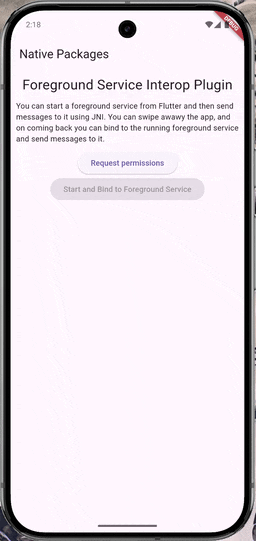

# foreground_service_interop_plugin

See overview in [this blog post](https://roszkowski.dev/2026/jni-foreground-service/).

- starting and binding to a foreground service from Flutter
- requesting and checking for notification permissions directly from Dart
- sending messages from Flutter to foreground service
- receiving messages from foreground service notification as if it was a messaging app