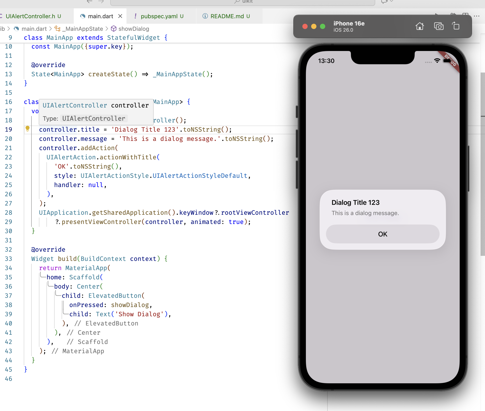

# uikit

Demo of using UIKit bindings in Dart via ffigen. This project has been transferred to its own repository: [uikit_bindings](https://github.com/orestesgaolin/uikit_bindings).

tl;dr: generating Dart bindings to Obj-C headers works flawlessly; code is invoked via `dart:ffi` and syntax looks Dart-y.

## Setup

1. To regenerate bindings run `dart run ffigen